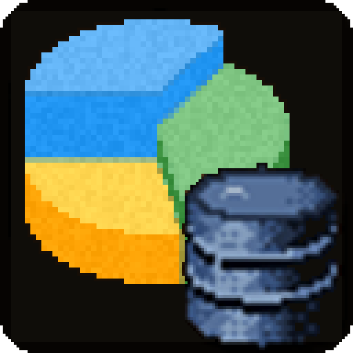

# Glimpse: Statistics

<p align="center"></p>

<p align="center">
  <a href="https://github.com/N3zr0k/Glimpse_Statistics/releases"></a>
  <a href="https://github.com/N3zr0k/Glimpse_Statistics/releases"></a>
  <a href="https://github.com/N3zr0k/Glimpse_Statistics/commits/main"></a>
  <a href="https://github.com/N3zr0k/Glimpse_Statistics/actions/workflows/ci.yml"></a>
</p>

Shows what Glimpse records, per character and for the whole account: totals, today, the last 7 and 30 days, rates
per profession tier and breakdowns by creature, node, fish and zone. It offers the numbers to other addons, too.
Statistics counts nothing itself: everything comes from Glimpse: Database.

Requires [Glimpse](https://github.com/N3zr0k/Glimpse) 0.3.40 or newer with Glimpse: Database. For WoW Forever
(interface 16001).

## Contents

* [Features](#features)
* [Options](#options)
* [Commands](#commands)
* [Installation](#installation)
* [For developers](#for-developers)
* [Credits](#credits)
* [License](#license)

## Features

| Group | Counters | Recorded by |
| --- | --- | --- |
| Combat | Creatures killed (per creature and per zone), your deaths (per killer and per zone), time in combat, corpses looted | Glimpse (tab Combat) |
| Fishing | Casts and catches (per zone), fish caught (per fish and per zone), catch rate in total and per profession tier | Glimpse: Professions |
| Gathering | Creatures skinned (per creature), herbs, ore and other nodes gathered (per node) | Glimpse: Gathering |
| Deeprun Tram | Rides (in total and per destination), distance, riding time (fixed 58 seconds per ride) and time spent in the tram | Glimpse (module Travel) |
| Character | Distance walked, ridden, swum, dived and as ghost; jumps (space bar, from the ground) | Glimpse (module Travel) |
| Travel | Distance by ship or zeppelin, zones visited and time per zone, flight points known, teleports, flights, flight time and flight distance per route, average flight | Glimpse (module Travel) |

* **Only what is installed:** a group is shown when the addon that records it is installed. Without Glimpse: Professions there is no fishing, without Glimpse: Gathering no gathering.
* **Periods:** today, the last 7 and the last 30 days, counted from midnight local time.
* **Profession tiers:** the catch rate per tier (Apprentice, Journeyman ...) comes from the casts and catches Glimpse:
  Professions records per tier. Counts from before that are only in the totals.
* **Counts from before Glimpse:** starting values from Blizzard's statistics (kills, deaths, fish caught) are part of
  the totals, but not of periods, rates and breakdowns.
* **Units:** distance in km (German) or miles (English), below 1 km in metres and below 1 mile in yards, times as "3 h 12 min". Zones visited and flight points
  count each one once (on the account too) and have no periods.
* **Names:** Glimpse: Database stores IDs. Fish, zones and flight points are named by the client; creatures and nodes by the
  name service of the Glimpse core, otherwise by their ID.
* **Statistics window:** the overview in a movable, resizable window, with or without frame. Click a group heading to fold it away or open it again; the choice is remembered per character.
* **Backup, transfer, reset:** in the tab Data of the Glimpse options (Glimpse: Database).

Settings (window) are stored in the Glimpse profile (namespace `Statistics`).

## Options

Open them with `/gli config`, then Glimpse > Statistics.

* **Options:** overview and where the numbers come from.
* **Window:** frame, font size (8 to 24), everything or this character only, reset position and size.

## Commands

| Command | Does |
| --- | --- |
| `/gli stats` | Overview of all counters (character, account in brackets) |
| `/gli stats account` | The same with the account numbers |
| `/gli stats details` | Overview with the three biggest entries and the tiers of each counter |
| `/gli stats <counter> [days]` | Breakdown of a counter by ID and zone (the ten biggest) or its last 14 days, e.g. `/gli stats kills` |
| `/gli stats account <counter> [days]` | The same for the account |
| `/gli stats [<counter>] verbose` | Everything about all counters or one counter |
| `/gli stats chars` | All characters with their main counters |
| `/gli stats status` | Database, namespaces and totals (also `/gli probe stats status`) |
| `/gli probe stats raw [counter]` | Values per source (own, imported, baseline), biggest IDs, periods |
| `/gli stats window` | Opens or closes the statistics window |
| `/gli stats blizzard [text \| all]` | What the client offers of Blizzard's own statistics; a text searches the names |
| `/gli stats trace` | Writes the client events to the chat and the debug log (troubleshooting), see [docs/EVENTS.md](docs/EVENTS.md) |

## Installation

Install [Glimpse](https://github.com/N3zr0k/Glimpse/releases) first, then unpack this addon next to it into the AddOns
folder of the Forever client, during the beta for example `D:\Games\World of Warcraft\_classic_beta_\Interface\AddOns`.
The folder must be called `Glimpse_Statistics`.

## For developers

Statistics only reads. To read single counters, ask Glimpse: Database directly (`GlimpseDB:Get("combat")`, see the
DEVELOPER.md of Glimpse). Statistics maps its counters to namespaces and kinds in `Core/Counters.lua`:

| Counter | Namespace | Kind | Breakdown |
| --- | --- | --- | --- |
| `kills`, `deaths` | `combat` | `kill`, `death` | creature (0 = unknown), zone; starting value from Blizzard |
| `fishing.casts`, `fishing.catches` | `fishing` | `cast`, `catch` (`casttier`, `catchtier` per tier) | zone; catches with starting value |
| `fishing.items` | `fishing` | `fish` | item, zone |
| `skinning` | `gathering` | `skin` | creature, zone |
| `gathering.herb`, `.ore`, `.other` | `gathering` | `herb`, `ore`, `other` | object, zone |
| `combat.time`, `combat.looted` | `combat` | `time` (seconds), `looted` | -, creature and zone |
| `travel.distance`, `travel.time` | `travel` | `distance` (yards), `traveltime` (seconds) | mode 1 walking to 8 Deeprun Tram; not in the overview, but in the API and with `/gli stats travel.distance` |
| `char.walked`, `.ridden`, `.swum`, `.dived`, `.ghost`, `travel.ship` | `travel` | `distance` of mode 1, 2, 3, 7, 5, 6 | - |
| `tram.rides` | `travel` | `tram` | destination 1 Stormwind, 2 Ironforge, 0 unknown |
| `tram.distance`, `tram.time`, `tram.stay` | `travel` | `distance` and `traveltime` of mode 8, `zonetime` of zone -369 | - |
| `travel.teleports`, `jumps` | `travel` | `teleport`, `jump` | - |
| `travel.zones`, `travel.zonetime` | `travel` | `zone`, `zonetime` (seconds) | zone |
| `travel.flightpoints` | `travel` | `flightpoint` | flight point (nodeID) |
| `travel.flights`, `travel.flighttime`, `travel.flightdistance` | `travel` | `flight`, `flighttime` (seconds), `flightdistance` (yards) | route `from * 10000 + to` |

Check that the addon is there (`Glimpse.Statistics ~= nil`) and keep working without it.

**Data API** (`Core/Api.lua`, API_VERSION 5): `GetInfo()`, `GetTopicList(kind)` and
`Query({ topics, kind, scope, periods, tiers, breakdown })` return data in a fixed schema, organized in topics
(`fishing`, `herbalism`, `mining`, `skinning`, `kills`, `deaths`, `combat`, `travel`, `tram`, `character`); every metric carries its `unit`. The full schema is at the top of `Core/Api.lua`.
Message `GLIMPSE_STATISTICS_UPDATED (key, topic, metric)` after every change in Glimpse: Database that concerns a
counter. Since API 5 there are no own counters any more (`RegisterStat`, `Add`, `RegisterTopic` are gone).

| Function | Does |
| --- | --- |
| `:Get(key, scope)` | Total with starting value; scope `"char"` (default), `"account"` or a character index |
| `:GetCounted(key, scope)` / `:GetBaseline(key, scope)` | Without starting value / only the starting value |
| `:GetSum(key, scope, days)` | Last days, 1 = today |
| `:GetBreakdown(key, scope, limit)` / `:GetZoneBreakdown(key, scope, limit)` | `{ key, name, count }`, biggest first |
| `:GetTierCounts(key, scope)` | `{ max, name, count }` per profession tier |
| `:GetSince(scope)` / `:GetFirst(key, scope)` | Since when / first and last count |
| `:GetSeries(key, scope, days)` | Totals per day for graphs |
| `:GetCharacters()` / `:CharacterName(index)` | Character indexes of Glimpse: Database, the current one first |

The addon lives in the folder `Glimpse_Statistics/` of the repository; link that folder into the AddOns folder
(junction) and `/reload` after each change. The tests load the real Glimpse: Database from the Glimpse repository next
to this one (or `GLIMPSE_DIR`). Checks:

```
lua tests/run.lua
luacheck .
python3 tools/check.py
```

## Credits

Author: N3zr0k. Special thanks to Flovy and sMash for testing.

## License

MIT, see [LICENSE](LICENSE).
